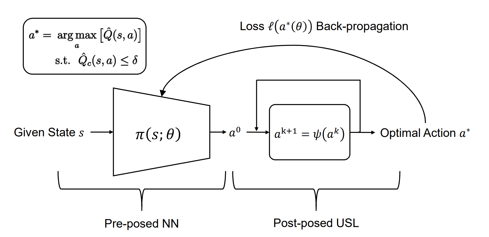

# Safety++
This is the author's implementation of **Safety++: Learning State-wise Safe Policies with a Deep Unrolling Architecture**

### Framework



The deep unrolling architecture of Safety++. At each decision-making moment, the pre-posed policy network outputs near-optimal action a_0; the post-posed unrolling safety layer (USL) takes a_0 as the initial solution and iteratively performs gradient-based correction to enforce the hard constraint. Back-propagation of the state-wise constrained objective guides the policy optimization.

### Installation

```bash
pip install -r requirement.txt
```

### Usage

Reproduce experimental results for the *Stabilization* task.

```bash
cd cartpole
python main.py --use_usl (--seed 0 --exp_name XXX) 
# change --use_xxx option to specify algorithms
chmod +x plot.sh
./plot.sh
```

Reproduce experimental results for the *PathTracking* task.

```bash
cd dronetracking
python main.py --use_usl (--seed 0 --exp_name XXX)
# change --use_xxx option to specify algorithms
chmod +x plot.sh
./plot.sh
```

Reproduce experimental results for the *SpeedLimit* task.

```bash
cd antrun
python main.py --use_usl (--seed 0 --exp_name XXX)
# change --use_xxx option to specify algorithms
chmod +x plot.sh
./plot.sh
```

Reproduce experimental results for the *SafetyGym-PG* task.

```bash
cd safetygym
python main.py --use_usl (--seed 0 --exp_name XXX)
chmod +x plot.sh
./plot.sh
```

### Reference

> https://github.com/sfujim/TD3
> https://github.com/openai/safety-gym
> https://github.com/utiasDSL/safe-control-gym
> https://github.com/SvenGronauer/Bullet-Safety-Gym


